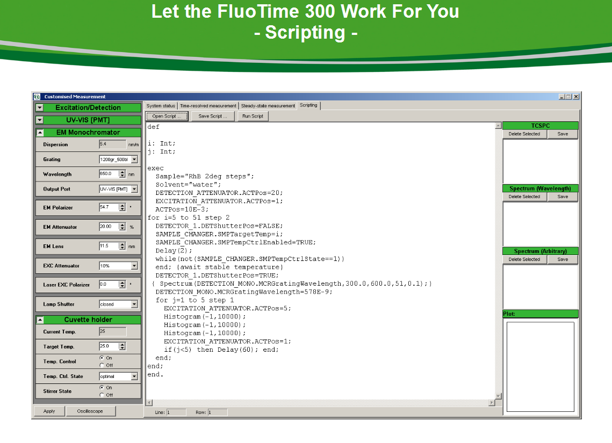

EasyTau-Scripts
===============

This is a compilation of scripts for EasyTau the System software of the FT300 made by PicoQuant (http://www.picoquant.com)

 * ``Formulas Easy Tau.txt``   
This document displays common formulas for EasyTau phaser plot, used to calculate several types of data (Corrected excitation and emission spectra, anisotropy, Quantum yields...).
 * ``IRF-TRES.txt``  
This Script will measure a TCSPC histogram at a given wavelength and then a set of IRFs in a range of wavelengths. It is defined for a FT300 with a rotating sample holder.

 * ``SCRIPT IRF + TRES for 1 sample   - 1 cuvette sample holder.txt``    
 This Script will measure a IRF and then a set of decays in a range of wavelengths. It is defined for a FT300 with a fixed sample holder.

 * ``SCRIPT IRF + TRES for 1 sample - 4 cuvette sample holder (defined_integration_time).txt``  
 This Script will do a TRES measurement integrating for a specific time at each wavelength.  It is defined for a FT300 with a rotating sample holder.

 * ``SCRIPT IRF + TRES for 3 samples - 4 cuvette sample holder.txt``  
 This Script will measure a IRF and then a set of decays in a range of wavelengths for three different samples. It is defined for a FT300 with a rotating sample holder.

 * ``SCRIPT Laser charcterization - 1 cuvette sample holder.txt``  
Script to perfom a decay of a single-exp-refernce-dye and a TRES of the laser around its emission maximum (IRF).  It is defined for a FT300 with a fixed sample holder.After the decay measurement of the refernce sample open the lid and exchange the sample for a Ludox cuvette.

 * ``SCRIPT Laser charcterization - 4 cuvettes sample holder.txt``  
Script to perfom a decay of a single-exp-refernce-dye and a TRES of the laser around its emssion maximum IRF. It is defined for a FT300 with a rotating sample holder. Sample in position 1, IRF in position 4.

 * ``SCRIPT Time_Gated_Spectra_Measurement.txt``  
 This script performs a Phosphorescence time gated sepctra, exciting with a flsh lamp. A decay is colected for several seconds at increasing waveleghts and time gates are defined to display the gated spectra on the run.
 
 * ``TRES_defined_integration_time.txt``  
 This Script will do a TRES measurement integrating for a specific time at each wavelength.
 
 * ``Anisotropy_at_a_fixed_emission_wavelength.txt``  
This script switches between VV and VH several times at a fixed wavelength in order to calculate anisotropy and control fluorophore degradation. 
The G factor must be calculated in a separate measurement.
The script can be used with CW or pulsed excitation. In the latter case the decays can also be used to calculate time resolved anisotropy
